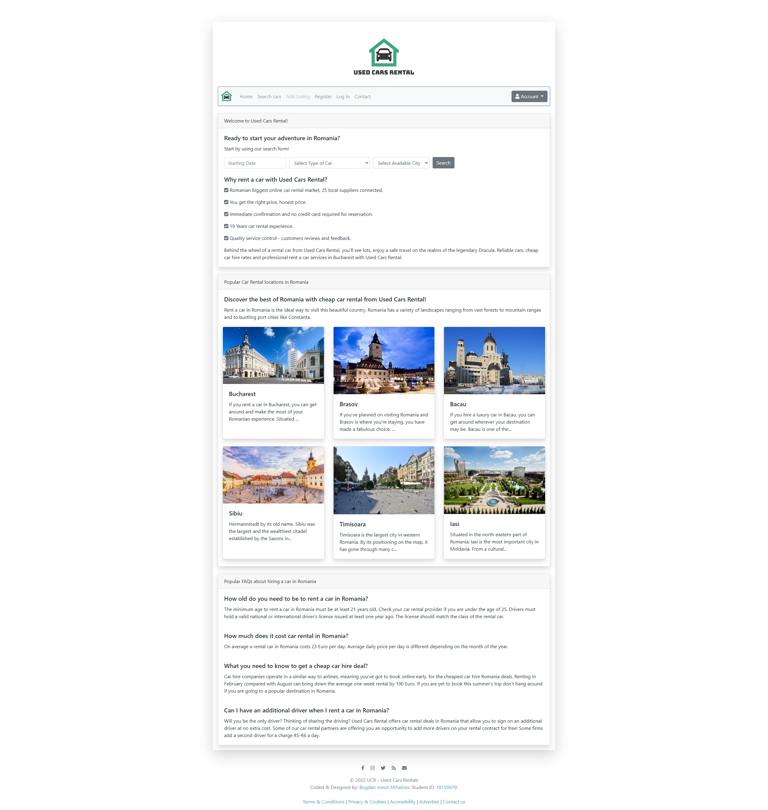
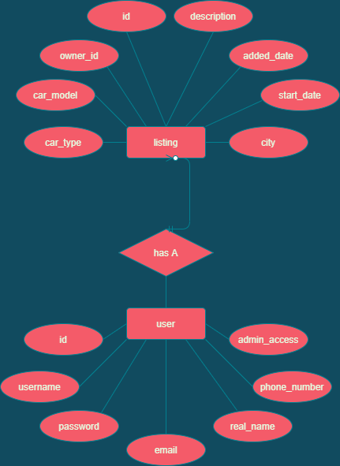

# UsedCarsRental
> Used Cars Rental platform developed for an assignment during my studies at [_Birmingham City University_](https://bcu.ac.uk). 
> Live demo [_here_](https://bogdanmihalcea.ro/projects/usedcarsrental).

## Table of Contents
* [General Info](#general-information)
* [Technologies Used](#technologies-used)
* [Features](#features)
* [Screenshots](#screenshots)
* [Project Status](#project-status)
* [Room for Improvement](#room-for-improvement)
* [Contact](#contact)

## General Information
This is a project I worked on for an assignment during university. It is an online platform where users can add listings for used cars rentals.

All backend PHP code is in "inc" folder.

The website is using PDO for the database connection.

All content is stored locally; nothing is loaded externally.

Bootstrap starter template was used in creating the website.

Test credentials:

ADMIN ACCOUNT:

username: 

`bogdan`

OR

username: 

`bogdan.mihalcea@icloud.com`

password: 

`Testadmin123!`

USER ACCOUNT:

username: 

`denyxp31`

OR

username: 

`denyxp31@gmail.com`

password: 

`Testuser123!`

## Technologies Used
- PHP with PDO for database connection
- MySQL (databae dump is included in the project - database.sql)

## Features
- Each admin has access to an index admin page: `admin.php`
- Each admin has access to see and manage all listings: `admin_listing.php`
- Each admin has access to see and manage all users: `admin_user.php`
- Each logged-in user can see their listings, where they can also delete their listings: `my_listing.php`
- Each logged-in user has a profile where they can edit their info: `profile.php`
- Each logged-in user can submit a new listing of a car: `new_listing.php`
- Each visitor can search for a car: `search.php`
- Each visitor can register: `register.php`
- Each visitor can log in: `login.php`
- Each logged-in user can log out: `logout.php`
- Some pages are restricted depending if you are logged-in / logged out / are an admin.

## Screenshots

## Project Status
Project is: _complete_ & _no longer being worked on_.

## Room for Improvement
Room for improvement:
- Some user input data needs more work on validation

## Contact
Created by [@Bogdan Mihalcea](https://bogdanmihalcea.ro/) - feel free to contact me!